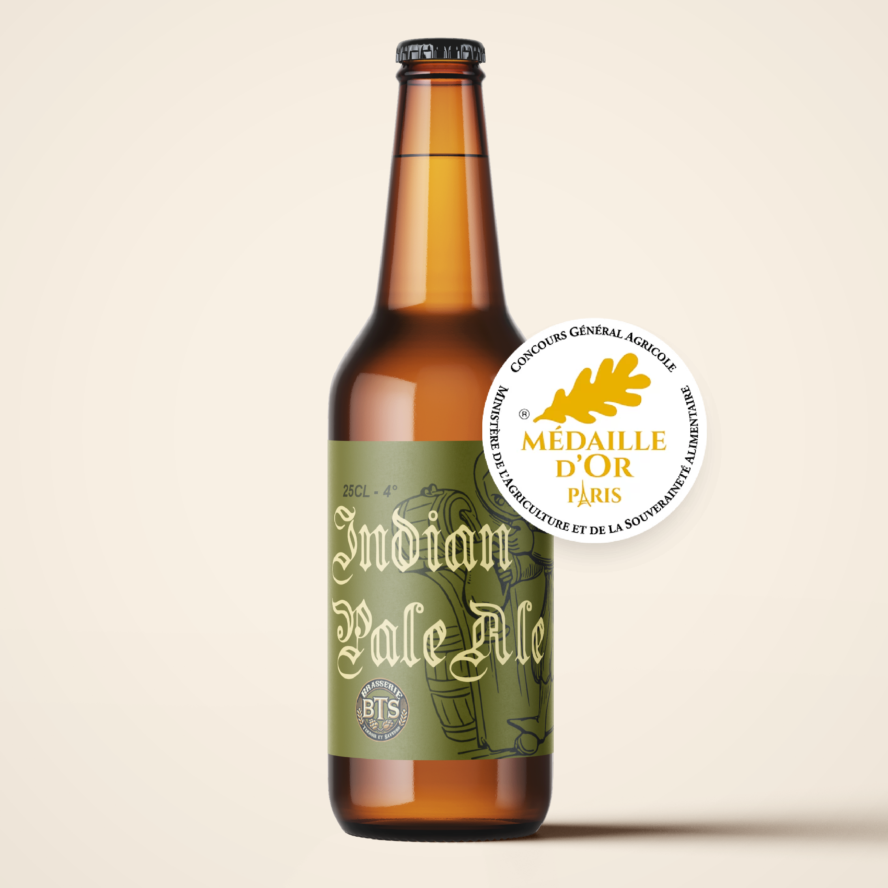
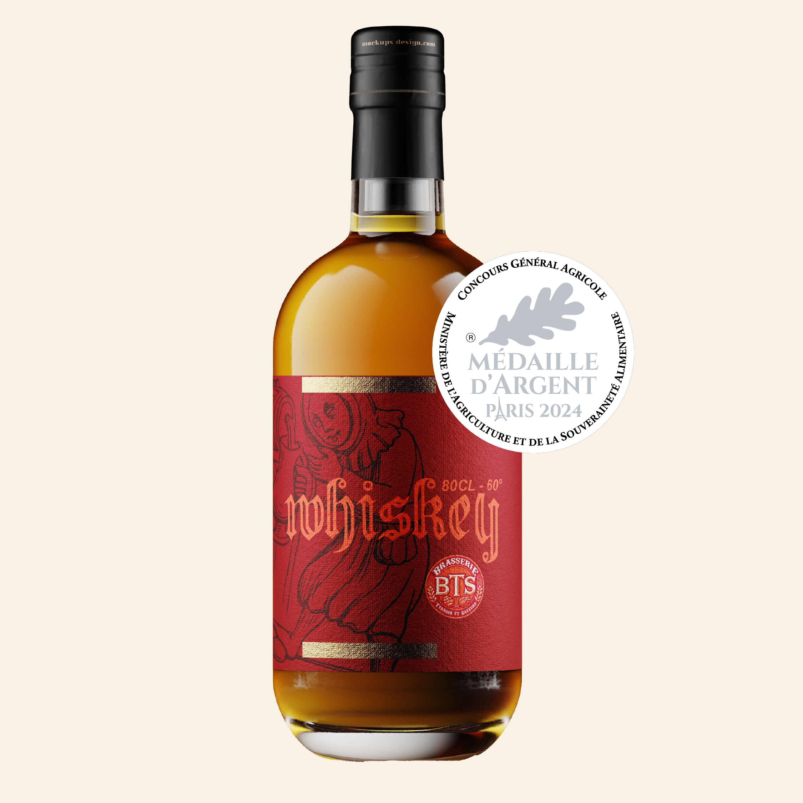
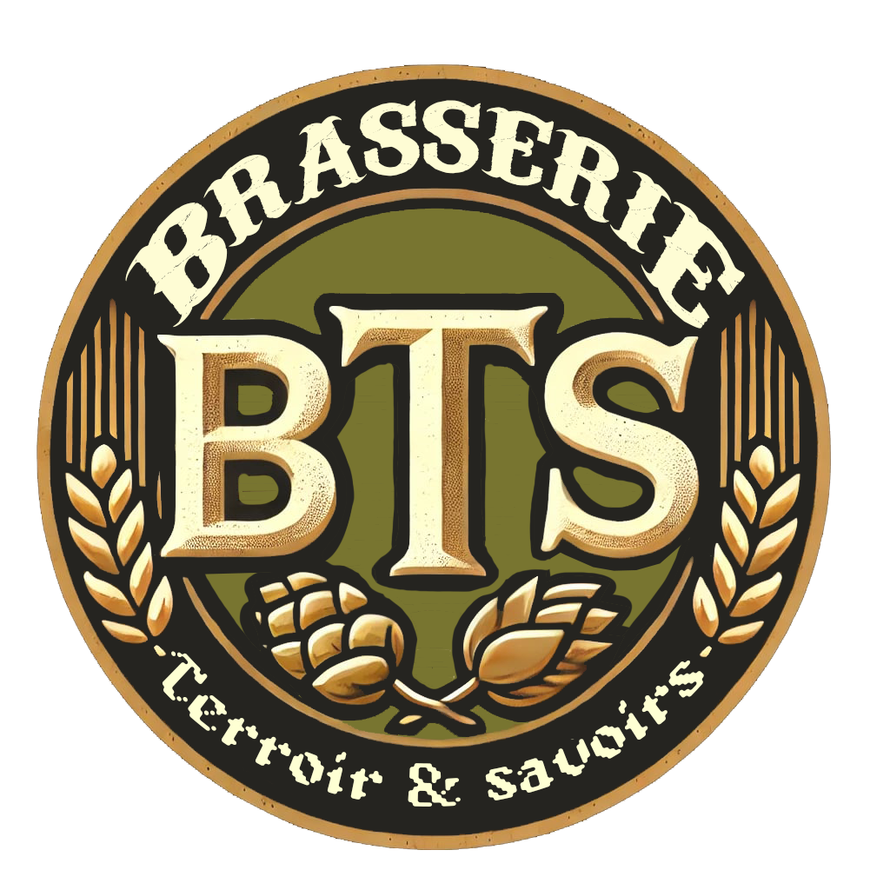

# BTS - Brasserie Management System

Une application web complète pour la gestion d'une brasserie, incluant catalogue de produits et interface utilisateur interactive.

## Table des matières

- [Aperçu](#aperçu)
- [Architecture](#architecture)
- [Structure du Projet](#structure-du-projet)
- [Installation](#installation)
- [Configuration](#configuration)
- [Utilisation](#utilisation)
- [Galerie](#galerie)

## Aperçu

BTS est une plateforme de gestion complète pour les brasseries, permettant de :
- Visualiser le catalogue de produits
- Gérer l'interface client
- Intégrer avec un backend robuste

## Architecture

Le projet suit une architecture **client-serveur** :

```
┌─────────────────────────────────────────┐
│         Frontend (Client Web)           │
│  - Interface utilisateur responsive    │
│  - Affichage des produits              │
└──────────────┬──────────────────────────┘
               │ API
┌──────────────▼──────────────────────────┐
│         Backend (Serveur)               │
│  - Gestion des données                 │
│  - Logique métier                      │
└─────────────────────────────────────────┘
```

## Structure du Projet

```
BTS/
├── README.md                          # Documentation
├── brasserie_logo.png               # Logo du projet
├── description_produit.txt           # Descriptions des produits
├── frontend/                          # Application frontale
│   └── [Fichiers React/Vue/etc.]
├── backend/                           # API serveur
│   └── [Fichiers Node.js/Python/etc.]
└── produits-0[1-5].png              # Images des produits
```

## Installation

### Prérequis

- Node.js (v14+) ou Python (v3.8+)
- npm ou pip
- Git

### Étapes

1. **Cloner le repository**
   ```bash
   git clone https://github.com/ethangomes8/BTS.git
   cd BTS
   ```

2. **Installer le frontend**
   ```bash
   cd frontend
   npm install
   ```

3. **Installer le backend**
   ```bash
   cd ../backend
   pip install -r requirements.txt
   # ou
   npm install
   ```

4. **Configuration des variables d'environnement**
   Créer un fichier `.env` à la racine avec :
   ````
   DATABASE_URL=your_db_url
   API_PORT=5000
   NODE_ENV=development
   ````

## Configuration

[Ajouter les détails de configuration spécifiques à votre projet]

## Utilisation

### Démarrer l'application

**Backend**
```bash
cd backend
npm start
# ou python app.py
```

**Frontend**
```bash
cd frontend
npm start
```

L'application sera accessible sur `http://localhost:5137`

## Galerie

Voici un aperçu des interfaces de notre application :

| Aperçu 1 | Aperçu 2 | Aperçu 3 |
|----------|----------|----------|
|  |  |  |

| Aperçu 4 | Aperçu 5 | Logo |
|----------|----------|------|
|  |  |  |


---
